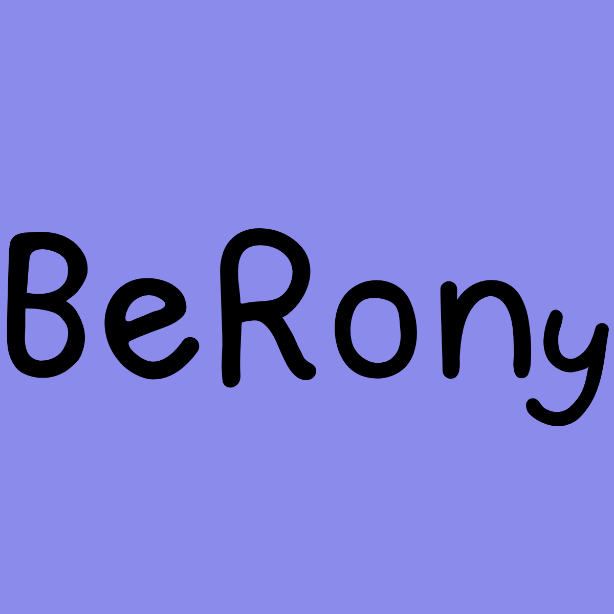

# BeRony

The virtual place where you can bring your stories to life. Whether you want to:

- **Write** your thoughts,
- **Visualize** your ideas,
- **Create videos** to share your message,

This platform has been carefully designed to showcase my learnings, memories, and more. 

So, why wait? Start creating and let the world see your work!

### Prototype and Documentation

[Figma](https://www.figma.com/design/MdKE4cZHqWNX5EfF0TskaQ/BeRony?node-id=0-1&t=NDjcIEaqz540ignf-1)

[Document](https://docs.google.com/document/d/1r846Ox72KJ1shtKyNrlCZoLMeOUpct84T4AcEgT5aqE/edit?usp=sharing)

> State: Development

### Workflow

### Future Features
- Authentication & Authorization ✅
- Share blogs throughtout various social media ✅
- Comment Section to share thoughts about posts ✅
- Reeling Blogs and vlogs (v1.0.1) ✅
- Create and share video blogs or vlogs ✅
- will introduce Android,ios applications 
- collaborative blogging (v1.0.1) ✅
- monetize your ideas
- Users can order Hard Copy of their favourite blog
- schedule blog publication ✅ 
- Scaling and Marketing

## Run Development 
1)  Clone the repository.
2)  Navigate to the project directory `cd BeRony`.
3)  Run `npm install` to install all dependencies and prepare BeRony for use on the DOM
4) Setup environment credentials and verify
5) Run `ng serve -o` to directly open the project in web.
6) Write and build your ideas and create a PR.
7) Every thing have an end but not this time.
